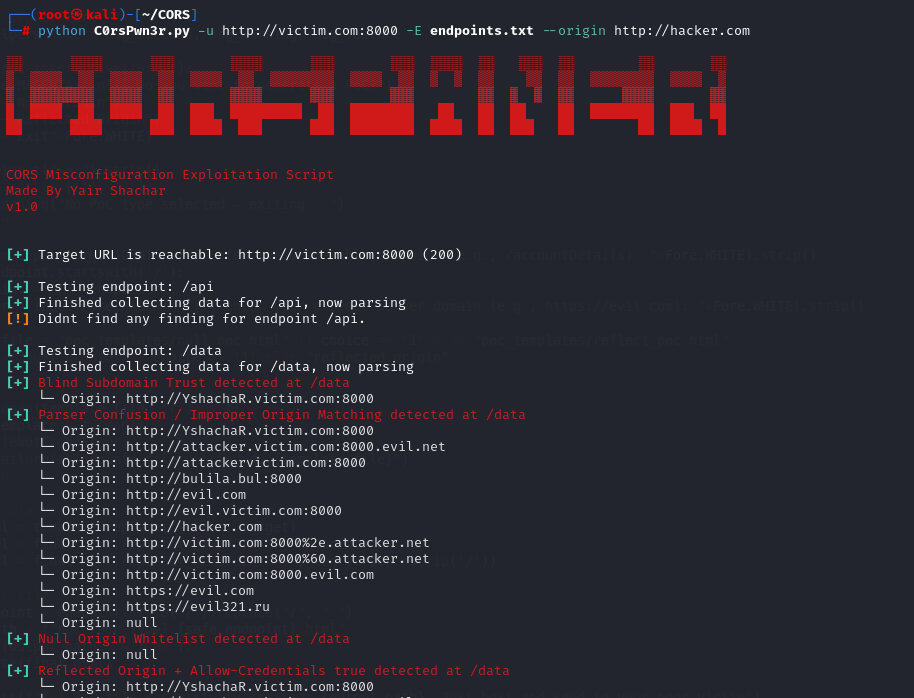
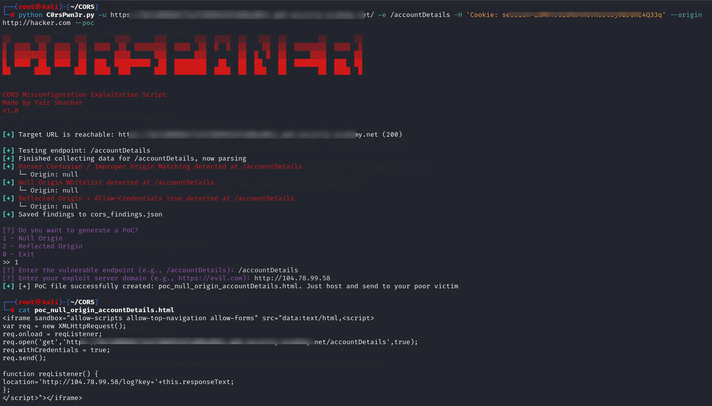

#  CORS Misconfiguration Exploitation Tool - C0rsPwn3r

A powerful and modular Python-based tool for discovering and exploiting **CORS misconfigurations** in web applications.

>Developed by [**Yair Shachar**](https://www.linkedin.com/in/yair-shachar-731566214/) – Red Team & Web Security Researcher


---

##  About CORS & This Tool

**CORS (Cross-Origin Resource Sharing)** is a browser mechanism to control which domains can communicate with a web application.  
When misconfigured, it can allow **unauthorized access** to protected APIs using cross-origin JavaScript requests leading to **data exfiltration**, **token theft**, or even **session hijacking**.

This tool automates:

-  Testing multiple crafted `Origin` headers
-  Detecting CORS misconfigurations (Reflected, Null, Wildcard, etc.)
-  Analyzing behavior of `Access-Control-Allow-Origin` and `Access-Control-Allow-Credentials`
-  Exporting findings to JSON
-  Generating **real HTML PoC exploits** for vulnerable endpoints

---

##  Screenshots

###  Normal Scan


###  Generated PoC HTML


---

##  Usage

**Basic scan against a single endpoint**

`python C0rsPwn3r.py -u https://victim.com -e /api/user -o https://evil.com`

**Scan multiple endpoints from file**

`python C0rsPwn3r.py -u https://victim.com -E endpoints.txt -o http://attacker.com`

`endpoints.txt`

```markdown
/api/user
/api/profile
/api/data
```

**Use custom headers (e.g., auth tokens)**

`python C0rsPwn3r.py -u https://victim.com -e /private -o https://evil.com -H "Authorization: Bearer abc123"` 

**Send requests through proxy**

`python C0rsPwn3r.py -u https://victim.com -e /api/test -o http://evil.com -p http://127.0.0.1:8080`

**Disable SSL verification (for self-signed certs)**

`python C0rsPwn3r.py -u https://selfsigned.dev -e /api/data -o http://evil.com--verify-ssl`

**Use extended origin types**

`python C0rsPwn3r.py -u https://victim.com -e /api/secure -o http://evil.com --extended`

**Full scan + PoC generation**

`python C0rsPwn3r.py -u https://target.com -E endpoints.txt -o http://attacker.com --poc`


##  Flags

| Flag | Description |
|------|-------------|
| `-u`, `--url` | **(Required)** Target base URL. Example: `https://victim.com` |
| `-e`, `--endpoint` | Test a **single endpoint**. Example: `/api/data` |
| `-E`, `--endpoints` | Path to a **file containing multiple endpoints** (one per line) |
| `-o`, `--origin` | The **base Origin** to test against. Tool builds many variants automatically |
| `-H`, `--header` | Add **custom HTTP header(s)**. Can be used multiple times. Example: `-H "X-API-Key: secret" -H "Authorization: Bearer abc123"` |
| `-p`, `--proxy` | Send all traffic through a proxy. Example: `http://127.0.0.1:8080` |
| `--verify-ssl` | Disable SSL certificate verification. Useful for self-signed certs. |
| `--extended` | Add additional **advanced Origins** to test: `file://`, `localhost`, browser extensions, etc. |
| `--poc` | After scanning, **generate an HTML Proof-of-Concept** based on detected misconfiguration |

##  Installation
```bash
git clone https://github.com/YaiYai8/C0rsPwn3r.git
cd C0rsPwn3r
pip install -r requirements.txt

```
##  Notes

- All results are saved to: `cors_findings.json`
- PoCs are exported as HTML files like: `poc_reflected_origin_accountDetails.html`
- Works with **Python 3.6+**


##  TODO

Below are planned features and enhancements. Feel free to contribute!

- [ ] ➤ Accepts IPs
- [ ] ➤ More Methods

